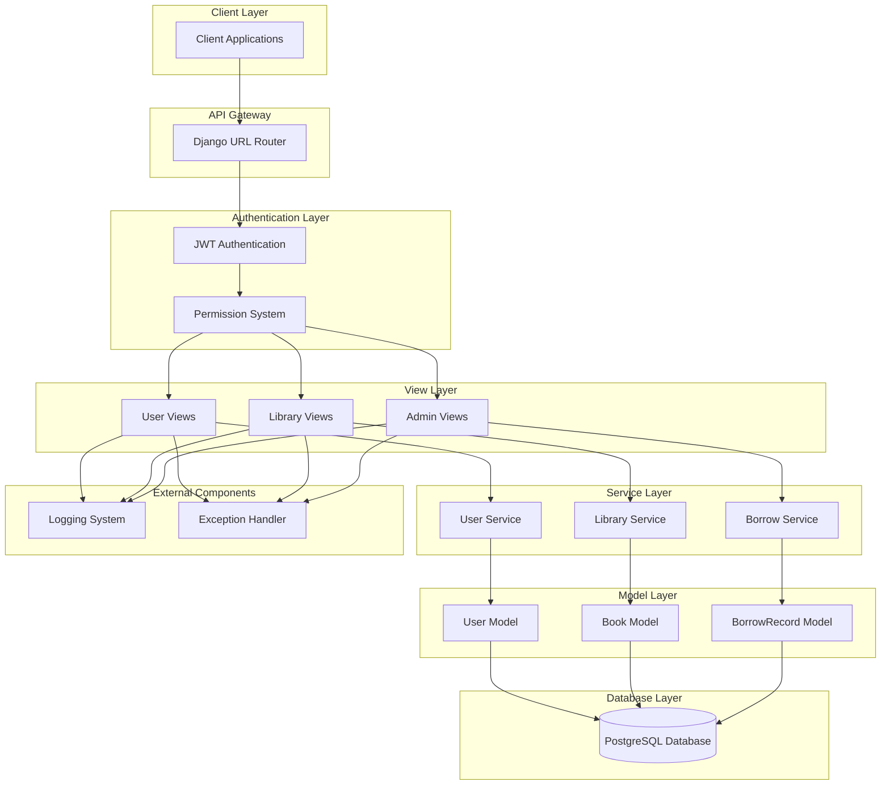
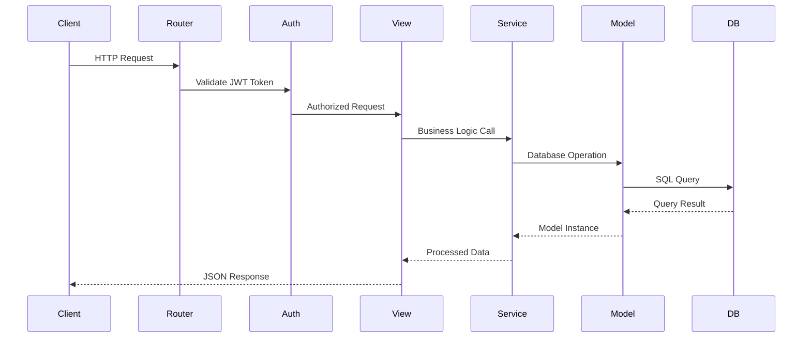
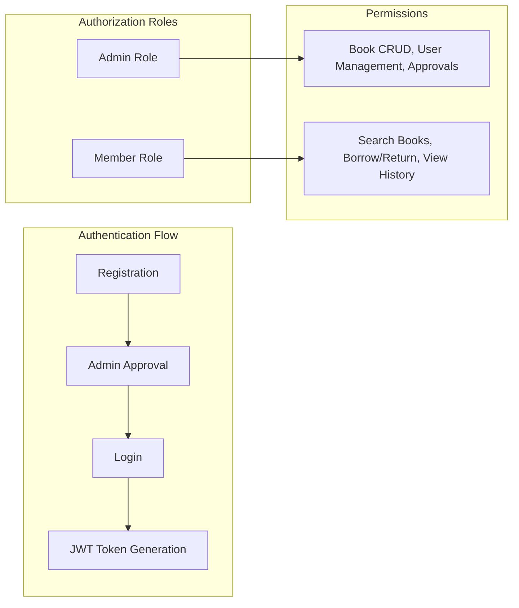
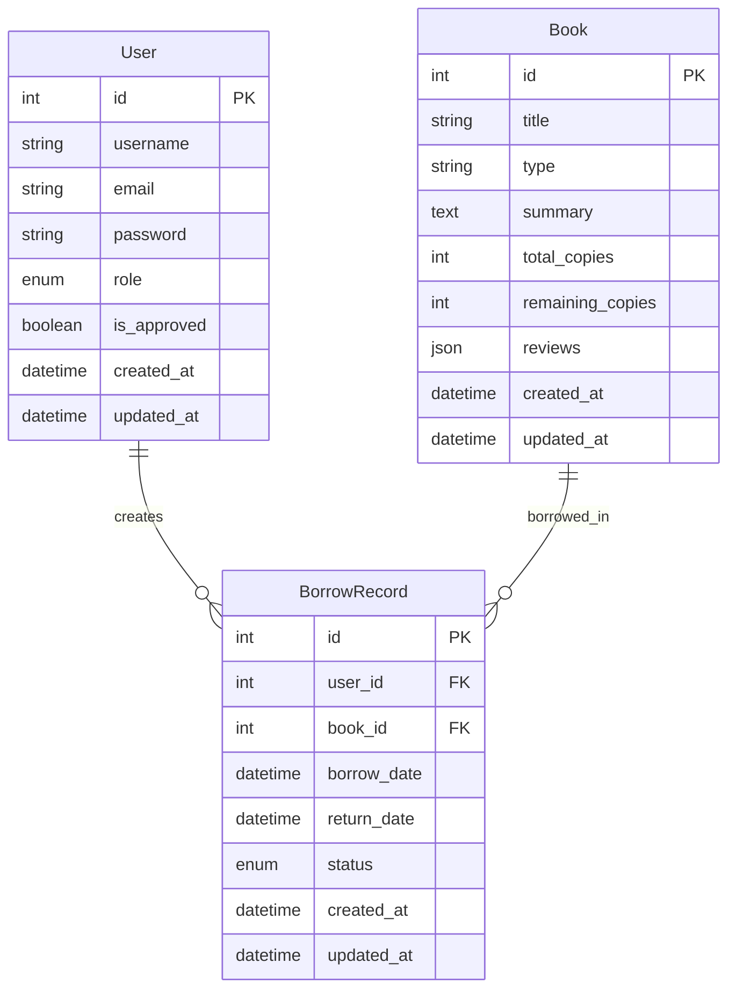
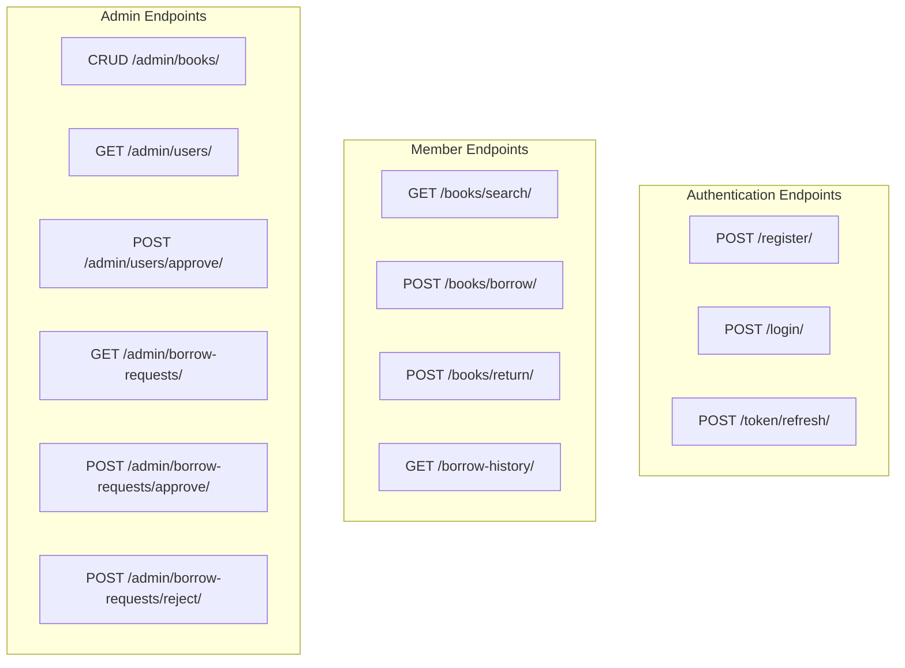
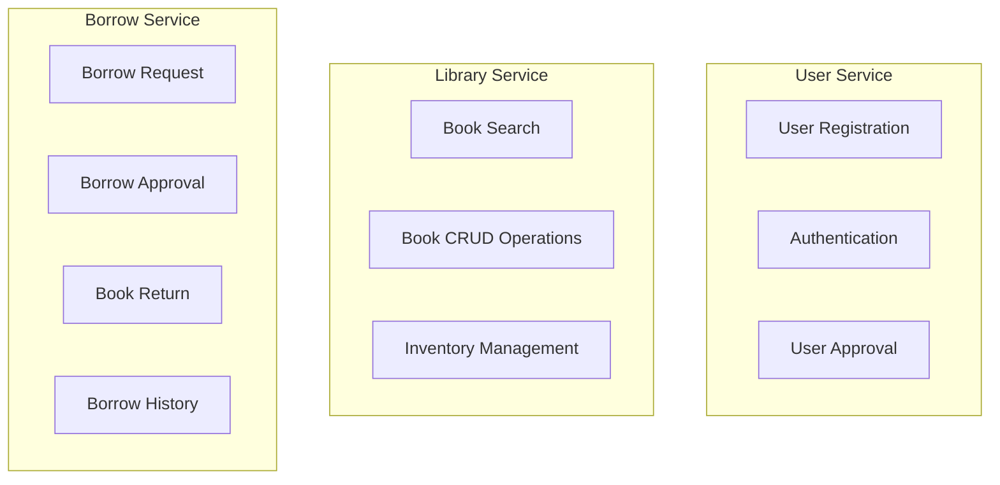
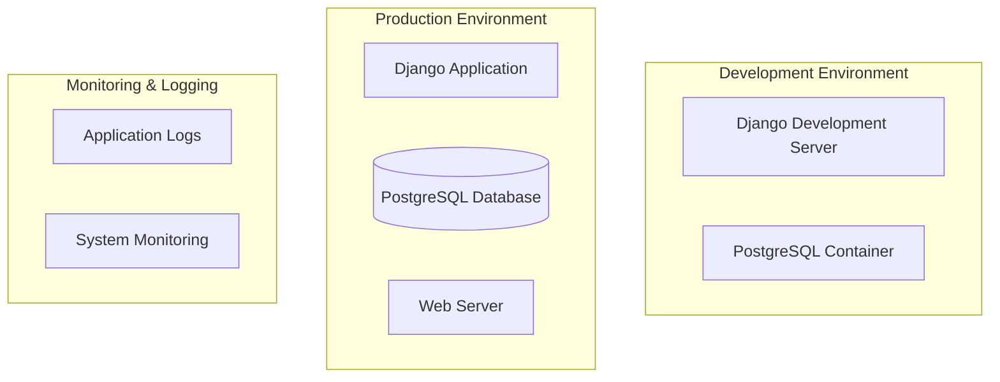

# 🏗️ Library Management System Architecture

## System Overview

The Library Management System is a RESTful backend application built with Django REST Framework, featuring JWT-based authentication, role-based access control, and PostgreSQL database integration.

## Architecture Diagram



## Component Architecture

### 1. Application Structure

```
lms_project/
├── lms_project/            # Django project configuration
│   ├── settings.py         # Environment configurations
│   ├── urls.py             # Root URL routing
│   └── wsgi.py/asgi.py     # WSGI/ASGI application
├── apps/                   # Modular application structure
│   ├── users/              # User management & authentication
│   └── library/            # Core library functionality
├── data/                   # CSV data files
└── requirements/           # Environment-specific dependencies
```

### 2. Request Flow Architecture



## Core Components

### 3. Authentication & Authorization



### 4. Data Models



### 5. API Endpoints Architecture



### 6. Service Layer Architecture



## Technology Stack

### Backend Framework
- **Django 5.2+**: Web framework
- **Django REST Framework**: API development
- **djangorestframework-simplejwt**: JWT authentication

### Database
- **PostgreSQL**: Primary database with ACID compliance
- **Docker**: Database containerization

### Additional Components
- **Custom Exception Handling**: Centralized error management
- **Logging System**: Application monitoring and debugging
- **Environment Configuration**: Development/Production separation
- **API Documentation**: drf-yasg or drf-spectacular

## Deployment Architecture




## Security Considerations

- JWT-based stateless authentication
- Role-based access control (RBAC)
- Input validation through DRF serializers
- SQL injection prevention via Django ORM
- CSRF protection for web interfaces
- Environment-based configuration management

## Scalability Features

- Modular app structure for easy feature addition
- Service layer separation for business logic
- Database indexing for performance optimization
- Stateless JWT authentication for horizontal scaling
- Docker containerization for deployment flexibility

## Layer Explanation

### 1. **View Layer** (Django Views/ViewSets)
The view layer handles HTTP requests and responses. It's the controller in the MVC pattern.

**Components:**
- **User Views**: Handle authentication endpoints (register, login, token refresh)
- **Library Views**: Handle book-related operations (search, list, retrieve)
- **Admin Views**: Handle administrative operations (user approval, book management)

**Responsibilities:**
- Receive HTTP requests from the URL router
- Validate request data using serializers
- Call appropriate service layer methods
- Format and return HTTP responses
- Handle pagination, filtering, and sorting

### 2. **Client Layer**
External applications that consume the API.

**Examples:**
- Web frontend (React, Vue, Angular)
- Mobile applications (iOS, Android)
- Third-party integrations
- API testing tools (Postman, curl)

### 3. **API Gateway Layer** (Django URL Router)
Routes incoming requests to appropriate views.

**Responsibilities:**
- URL pattern matching
- Request routing to correct view functions
- URL parameter extraction
- Middleware execution order

### 4. **Authentication Layer**
Handles security and access control.

**Components:**
- **JWT Authentication**: Validates JWT tokens in request headers
- **Permission System**: Checks user roles and permissions (ADMIN vs MEMBER)

**Flow:**
```
Request → JWT Token Validation → Permission Check → View Access
```

### 5. **Service Layer** (Business Logic)
Contains complex business rules and operations.

**Components:**
- **User Service**: User registration, approval workflows
- **Library Service**: Book inventory management, search logic
- **Borrow Service**: Borrowing rules, due date calculations, availability checks

**Why Separate?**
- Keeps views thin and focused
- Reusable business logic
- Easier testing
- Clear separation of concerns

### 6. **Model Layer** (Django ORM Models)
Defines data structure and database operations.

**Components:**
- **User Model**: User data, roles, authentication
- **Book Model**: Book information, inventory tracking
- **BorrowRecord Model**: Borrowing transactions, status tracking

**Responsibilities:**
- Database schema definition
- Data validation
- Relationship management
- Query optimization

### 7. **Database Layer**
Physical data storage using PostgreSQL.

**Features:**
- ACID compliance
- Relational data integrity
- Query optimization
- Backup and recovery

### 8. **External Components**

#### Logging System
- Captures application events
- Error tracking and debugging
- Performance monitoring
- Audit trails

#### Exception Handler
- Centralized error handling
- Consistent error responses
- Error logging and notification
- User-friendly error messages

## Layer Interaction Flow

```
Client Request
    ↓
API Gateway (URL Routing)
    ↓
Authentication (JWT + Permissions)
    ↓
View Layer (Request/Response Handling)
    ↓
Service Layer (Business Logic)
    ↓
Model Layer (Data Operations)
    ↓
Database Layer (Data Storage)
```

## Benefits of This Architecture

1. **Separation of Concerns**: Each layer has distinct responsibilities
2. **Maintainability**: Changes in one layer don't affect others
3. **Testability**: Each layer can be tested independently
4. **Scalability**: Easy to scale individual components
5. **Reusability**: Service layer logic can be reused across views
6. **Security**: Centralized authentication and authorization

This layered architecture follows Django best practices and enterprise-level application design patterns.